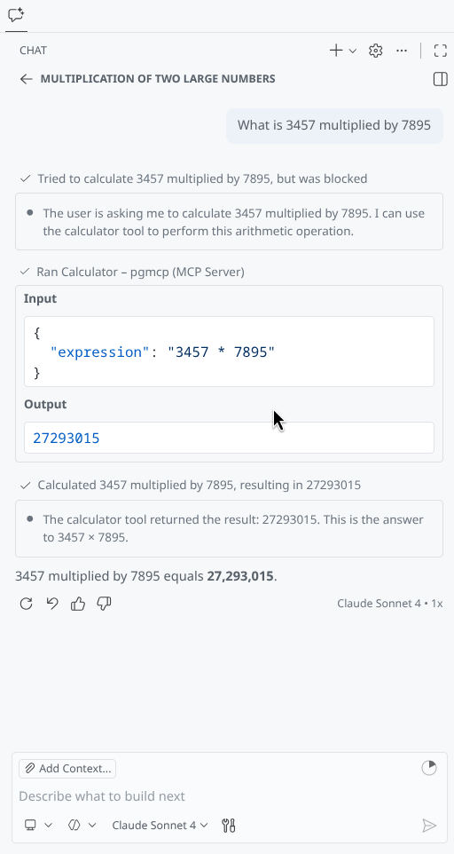

# pgmcp

MCP server PoC from _scratch_ in Go.

## Goals

- [ ] Transport Layer
  - [x] stdio
  - [ ] Streamable HTTP
- [ ] Data Layer
  - [x] Connection Initialization
  - [ ] Server features
    - [ ] Tools - query Postgres database

## Non-goals

- Authorization
- Server features
  - Resources 
  - Prompts
- Utility features
  - Logging

## Getting Started

```sh
go install cmd/pgmcp/pgmcp.go
```

## Screenshots

Calculator tool:


